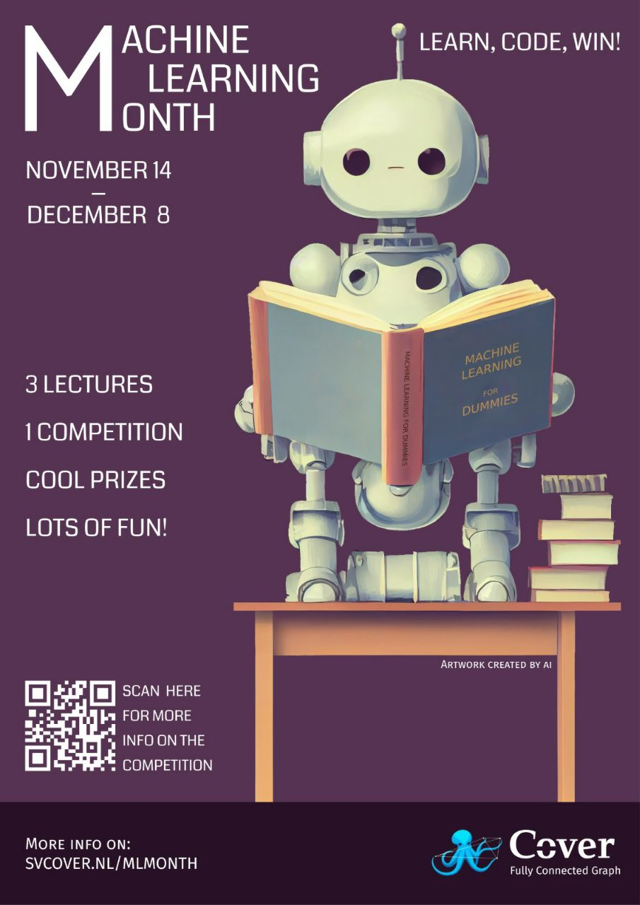
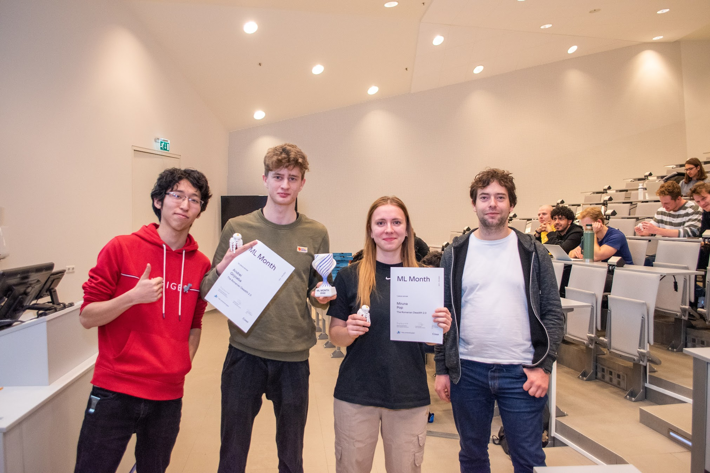
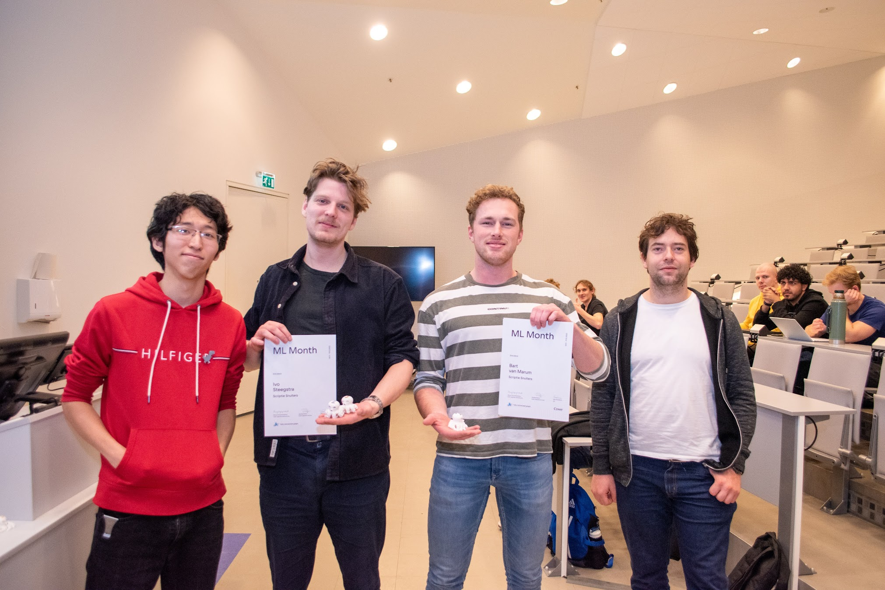
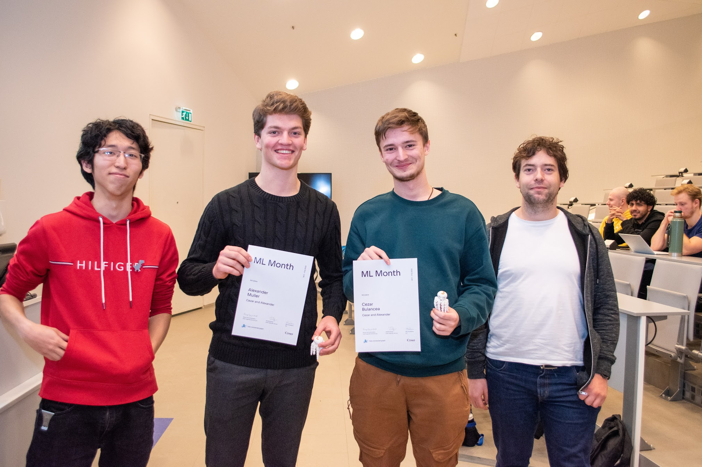

# Groningen Machine Learning Month 2022 | Reflection

Machine Learning Month is month long educational ML competition that we hosted as Fully Connected Graph for the students of University of Groningen. We were joined by students from different studies, levels from first year bachelors to master students and summing up to over a 100 participants.

Although, the event took place in the November-December 2022, I didn’t really get a chance to reflect on it, or at least record what was behind the scenes for the future FCG members.

The inspiration started back from Yandex. I was blown away by the quality of organization of their projects. That year I won their competition [RuCode](https://rucode.net/) 5.0 and I loved every moment of solving the problem. Also year, I studied at [Yandex Practicum](https://practicum.yandex.ru/) and loved their approach to teaching, explaining and serving the materials.

Shortly after, participating in Groningen Algorithmic Programming Contest (GAPC) 2022 and seeing the amount of people taking part made me realise that there is demand for such competitive events.

And knowing that my classmates are _hungry for real deal machine learning_ content I realised that I should host an extensive machine learning competition with lectures that would rank on Yandex level.

## Organisation process

In the summer I brainstormed some ideas for the competition. Remembering the classical pain of finding accommodation in the Netherlands, I decided to stick to it. Plus, I quickly found a huge [Netherlands Rent Properties](https://www.kaggle.com/datasets/juangesino/netherlands-rent-properties) dataset on Kaggle.

](./assets/my_channel.png)

Asking for ideas on what to make the competition about on my [Telegram channel](https://t.me/dinomomon/1446)

I preprocessed the dataset and waited till the end of block one.

Machine Learning Month poster; I love it so much, it’s amazing ✨

Jeremias and I on the last lecture (Introduction to Neural Networks)

## Lectures & Assignments

[Introduction to Machine Learning with Scikit-Learn](https://youtu.be/zxS9rZE0TI8)

Introduction to Machine Learning with Scikit-Learn

[Introduction to Natural Language Processing (ft. Gabriele Sarti)](https://youtu.be/iOHh0aLAAkk)

Introduction to Natural Language Processing (ft. Gabriele Sarti)

## Competition

## Results

1st place: Miruna Pop, Andrei Girjoaba

2nd place: Abe Brandsma, Bart van Marum, Ivo Steegstra

3rd place: Cezar Bulancea, Alexander Muller

## Conclusion
