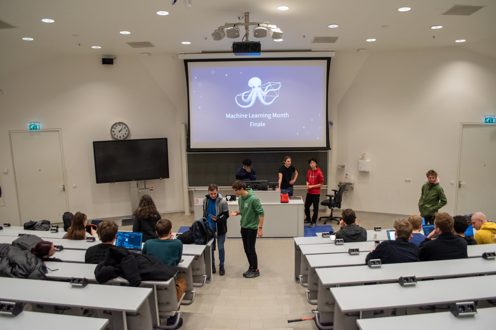

# Groningen Machine Learning Month 2022

_Event finale_

Machine Learning Month is month long educational ML competition that we hosted as Fully Connected Graph for the students of University of Groningen. We were joined by students from different studies, levels from first year bachelors to master students and summing up to over a 100 participants.

Although, the event took place in the November-December 2022, I didn’t really get a chance to reflect on it, or at least record what was behind the scenes for the future FCG members.

The inspiration started back from Yandex. I was blown away by the quality of organization of their projects. That year I won their competition [RuCode](https://rucode.net/) 5.0 and I loved every moment of solving the problem. Also year, I studied at [Yandex Practicum](https://practicum.yandex.ru/) and loved their approach to teaching, explaining and serving the materials.

Shortly after, participating in Groningen Algorithmic Programming Contest (GAPC) 2022 and seeing the amount of people taking part made me realise that there is demand for such competitive events.

And knowing that my classmates are _hungry for real deal machine learning_ content I realised that I should host an extensive machine learning competition with lectures that would rank on Yandex level.

## Organisation process

In the summer I brainstormed some ideas for the competition. Remembering the classical pain of finding accommodation in the Netherlands, I decided to stick to it. Plus, I quickly found a huge [Netherlands Rent Properties](https://www.kaggle.com/datasets/juangesino/netherlands-rent-properties) dataset on Kaggle.

](./assets/my_channel.png)
_Asking for ideas on what to make the competition about on my [Telegram channel](https://t.me/dinomomon/1446)_

I preprocessed the dataset and waited till the end of block one. In the meantime, we got a poster made by our designer, and I started looking for lecturers. Also, a new member joined our team, Jeremias, who was a great help in the organization process.

_Machine Learning Month poster; I love it so much, it’s amazing ✨_

I reached out to Gabriele Sarti, who was a lecturer at the University of Groningen and he agreed to give a lecture on Natural Language Processing. The other two lectures were given by Jeremias and me.

_Jeremias and I on the last lecture (Introduction to Neural Networks)_

## Lectures & Assignments

Introduction to Machine Learning with Scikit-Learn (ft. Mansur & Jeremias )

<iframe width="560" height="315" src="https://www.youtube.com/embed/zxS9rZE0TI8" title="YouTube video player" frameborder="0" allow="accelerometer; autoplay; clipboard-write; encrypted-media; gyroscope; picture-in-picture" allowfullscreen></iframe>

Introduction to Natural Language Processing (ft. Gabriele Sarti)

<iframe width="560" height="315" src="https://www.youtube.com/embed/iOHh0aLAAkk" title="YouTube video player" frameborder="0" allow="accelerometer; autoplay; clipboard-write; encrypted-media; gyroscope; picture-in-picture" allowfullscreen></iframe>

## Results

The competition was a huge success. We had over 100 participants on lectures, 13 competitors, 8 teams and 133 entries. I want to congratulate our top three winners:

- 🥇 **The Romanian Deadlift**: Miruna Pop, Andrei Girjoaba (Score: 87.8)
- 🥈 **Scriptie Snuiters**: Abe Brandsma, Bart van Marum, Ivo Steegstra (Score: 88.1)
- 🥉 **The Visioners**: Cezar Bulancea, Alexander Muller (Score: 100.8)

_1st place: Miruna Pop, Andrei Girjoaba_

_2nd place: Abe Brandsma, Bart van Marum, Ivo Steegstra_

_3rd place: Cezar Bulancea, Alexander Muller_

## Conclusion

Hosting this competition was a fantastic learning experience for me. Not only did I get to see the innovative solutions participants came up with, but I also gained valuable insights into machine learning and teaching. Special thanks to Gabriele Sarti for hosting a lecture on NLP, Marc Groefsema for being a jury on the competition, Jeremias Ferraro and the FCG team for being alongside and helping in all the organizational parts.

I look forward to hosting more competitions in the future and I welcome anyone who is interested to reach out to me or join upcoming competitions.
