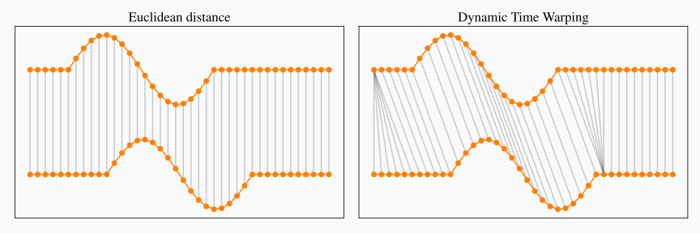

# Mind Your Building Hackathon

Recently as a company, [Researchable](https://researchable.nl/), we won the _Mind your Building_ _hackathon_. It was a month-long competition organized by _TNO_ in collaboration with the _Hanze University of Applied Sciences_, _DFKI_, and _AIMZ_, and supported by the _European Tailor-network_ project.

The challenge was to identify behavioural patterns related to building occupancy using sensor data and locate "missing" sensors in the building. Participants were provided with a floorplan, sensor-overview, and sensor data.

There were 4 types of sensors: basic, CO2, sound and door. The basic, sound and co2 sensors had data on temperature, humidity, light and motion. Some specific sensors had extra data such as CO2 and sound levels. The door sensors measured the if the door was closed or not.

Building floor plan with sensors located

Description available of sensors

Our solution utilized time-based pattern analysis and clustering to identify the location of the missing sensors. Overall, the challenge was a fantastic opportunity for us to apply our expertise in data analysis and demonstrate our problem-solving skills.

If you want to go more into the details of the solution here we go!

# Solution

## Data Analysis

I started off with a quick glance over the data to get the feel over it and look for missing values and anomalies. The sensor overview was first, it had zone names, floor numbers, sensor ids and the sensor names. Some of the sensors had a string `unknown` in places where if we had no idea where the sensor was.

Head of the sensor overview dataset

Sensor data included recordings of the respective sensor measurements in 10 minute intervals and vdd values. As mentioned earlier, all the sensors had measurements for temperature, humidity, light and motion and some specific to task had CO2 or sound levels.

Head of the basic sensor dataset

I suspect vdd had to be the voltage value for the sensor – determining whether the sensor is powered or not.

All the room sensor values where fine, except that some basic room temperatures were impossible values, for example, minimum temperature is -1000. Probably because it was when sensors were first set up or sensor malfunction. I decided upon setting these values as null and later backfilling them.

Rows that have temperature less than zero

The door sensors had three measurements – if it is open, the vdd and the counter. The counter stood for the cumulative number of times the door was opened.

I noticed that the counter column had 99% of values – zeros and some reached up to 5000. This is probably a malfunction of the sensor and later has to be checked out. For now we'll not use it.

Value counts of the counter column

Description of the door sensor set

Also, I checked for if there were any time gaps in the sensor measurements and for how long they lasted. As we can see there were 5 “data blackouts” where no sensor reported of data some of them lasting from 1-3 days up to 20 days.

## Data Preprocessing

Here I extracted the needed values such as the floor number, made a list of sensors that are unknown, fixed the impossible temperature, removed the vdd and counter columns, converted the `isOpen` column type to boolean and localized all the time to UTC.

List of names of unknown sensors

## Exploratory Data Analysis

First I wanted to see what patterns there are in the data, so I began looking for how it changed overtime.

### Over the year

In these plots the blue areas highlight the approximate summer and winter holidays, and the red line approximately indicates when covid has ended.

Looking at temperature and humidity we can see and obvious seasonality in the data – high temperature and humidity in the summer and low in winter.

The light shows a similar seasonality of data – _high in summer, low in winter_. Apparently, the light sensors pick up light not only from the lamps, but also from the sun.

Motion sensor seems to be a good indicator of if there are people in the zone or not because during the holiday season the motion falls off.

Looking at CO2 levels, I expected there to be a pattern if there are people on holiday, but it is difficult to see from here. What we can notice is that there was something placed in 2021 winter break in some room which increased the CO2 levels. I suspect this to be a refrigerator or a vending machine. There is also a sudden increase in CO2 levels which weared off in the post-summer of 2021.

Similarly to motion measurements we can see a nice pattern of the decrease in sound during the breaks.

Plotting if the door was open doesn’t make sense like this, but what we can see is that most of the doors are closed during the holidays. There is a room that is almost always has it's door closed.

### Over the day

Here I’ll show only the interesting ones. In here the same sensor data is averaged over a day.

Inspecting the light sensor we can see two groups formed. Referring back to the fact that the light sensor picks up also on the sunlight we may conclude that these two hills refer to sunrise and sunset.

Looking up from where does the sun rise we can conclude that using the light sensor we can determine on east or on west side of the building the room is.

Unsurprisingly inspecting the motion and sound results in high values during the working hours. Sometimes the motion sensors picked up on movement during the night, I suspect it to be noise or the flashes of shadows or movement from the windows.

Looking at CO2 and humidity levels we can see that there is a seasonality, during the night it increases and decreases during the day.

### View a day

As Andrew Karpathy suggested once – to better understand the data you have to look into the tiniest details of it, maybe even try to label it yourself. So, here I took an arbitrary day and observed how the CO2 and motion values changed.

As we can see, on some weekdays there is movement followed by increase in CO2, which is followed by movement and decrease in CO2. I suspect that this indicates the coming in and out of a class. We can use this observation for later to do occupancy prediction.

## Task 1. Searching for unknown rooms

My idea was that sensors that area near each other will have similar changes in their measurements, and if we correlate them, they will have relatively high correlation. For the values I’ve used the standard temperature, humidity, light and motion values and their derivatives as they are present in all sensors. The data was resampled to a similar 30 minute interval, pairwise Pearson correlated per-sensor and mean squared of the values was calculated.

It resulted in a huge table with correlation values.

Mapping the known sensors to their zone numbers and leaving only the unknown sensors we can see that this data shows some zone predictions. From here we can see that Ilse is most likely to be in the room 2.38, Sofie to be in 1.03, Kees to be in 1.03, Anne and Sven to be in 0.0.

Also, taking into account what type of sensors they are we can deduce where the rest of the sensors are located.

Making the final predictions, which later were confirmed to be correct.

| Sensor name | Sensor Id |
| ----------- | --------- |
| Anne        | Room 2    |
| Sven        | Sound 4   |
| Brian       | Room 5    |
| Kees        | Sound 15  |
| Sofie       | Room 11   |
| Ilse        | Sound 11  |

As a bonus, it is interesting to cluster these sensors using dendrograms and see what patterns emerge. Clearly we can notice that there are groups of sensors which are indeed close to each other.

Examples of nearby rooms which are clustered together:

Interestingly, if the light data is to be removed the clustering doesn’t work at as well meaning that determining what side the of the building room is located in is a good feature for the model.

### Task 2. Occupancy prediction

For the task of occupancy prediction we thought of making a logistic regression model with sliding window. To train the model we sat down to label the data ourselves using the an open source tool [Label Studio](https://labelstud.io/). Unfortunately, we didn’t have enough time to prepare the data and train the models.

### Future work

Apart from finishing labeling the data and training a model, I want to propose a way to improve the sensor search model. Currently it is comparing the two time series (signals) one-to-one, however this is not correct as one can be shifted which will result in a lower correlation score. To go around this we can use the [Dynamic Time Warping](https://en.wikipedia.org/wiki/Dynamic_time_warping) algorithm which using [dynamic programming](https://en.wikipedia.org/wiki/Dynamic_programming) to calculate the edit distance between the two signals, essentially mapping one signal onto another in the best way.

## Conclusion

In conclusion, participating in the _Mind your Building_ hackathon was an incredible opportunity for us to demonstrate our expertise in data analysis and problem-solving skills. Our solution utilized time-based pattern analysis and clustering to identify the location of the missing sensors. We also conducted exploratory data analysis to gain insights into the data that helped guide our approach to the problem.

Personally, it was a nice refresher into data science and I learned a lot in the process.

The data can be is uploaded and can be viewed on Kaggle (for right now it is private because I didn’t write any description for it).

[Mind Your Building](https://kaggle.com/datasets/0f320b38d988b1a332524182c08ccf6f517ad4623ed419b0de8978c63e6b6dd2)
