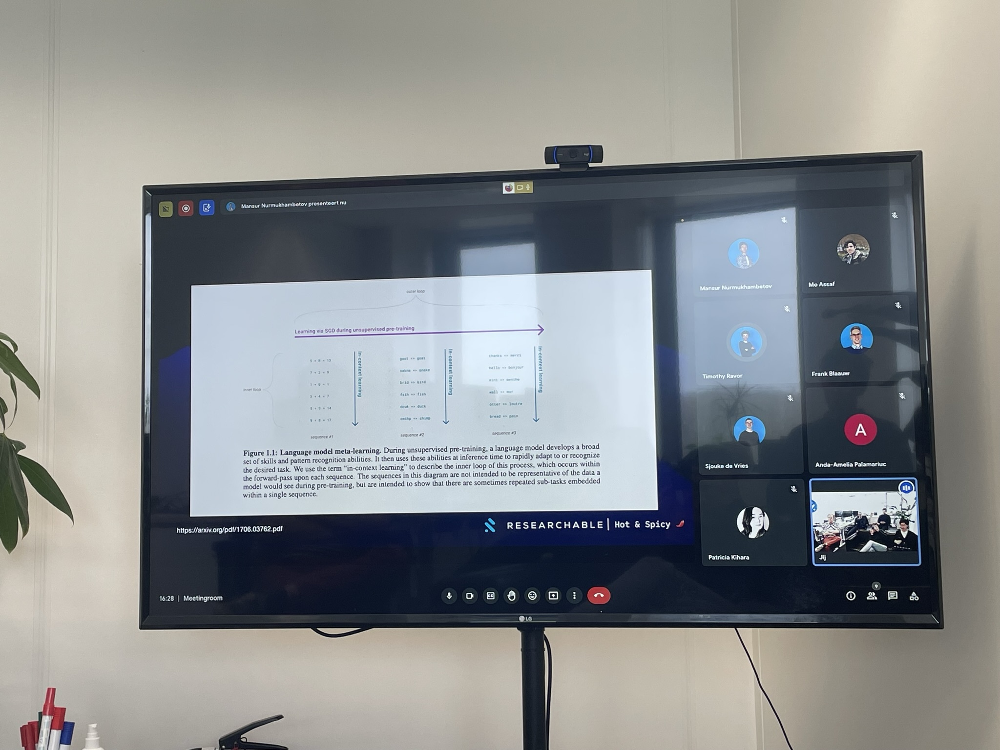
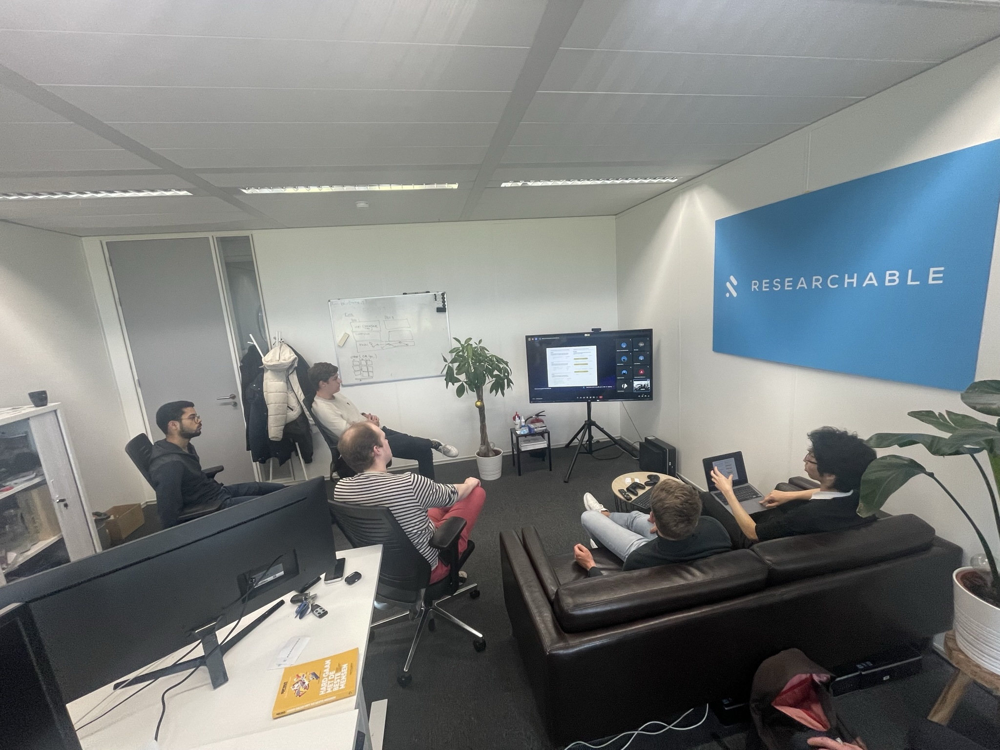

# H&S: Large Language Model Prompting

<aside>

🌶️ Hot & Spicy is a monthly knowledge session organized by [Researchable](https://researchable.nl/). The sessions are intended for technology enthusiasts who want to learn more about technology and it is a great place to meet like-minded people.

The meetups are very informal and always take place on Friday afternoons. _The speaker is not allowed to prepare the topic for more than two hours_. This creates an atmosphere in which discussions are encouraged.

</aside>

This month, I did a Hot & Spicy on Large Language Models and how they work.

Machine learning development goes so fast at the moment that it’s hard to keep up with the trends. The rise of language models like ChatGPT is rapidly changing our day to day process, and even in the ML field itself these large models introduce an emergent novel way of learning – _zero-shot learning_ (or _few-shot_).

In this H&S session we will explore: How the machine learning field is changing? What are language models? What does it have to do with attention and transformers? and go a bit philosophical on implications where it leads to.

<iframe width="560" height="315" src="https://www.youtube.com/embed/b0wRrNzfq60" frameborder="0" allow="accelerometer; autoplay; clipboard-write; encrypted-media; gyroscope; picture-in-picture" allowfullscreen></iframe>

Personally, I felt really intrigued while making the whole presentation, the two hour time limit made me stay focused on the main idea. I tried to keep it explain the technical ideas and the influence of them without going into further details of how it actually works. In the end, I love how it turned out and grateful for the interesting discussions it sparked. 😊

