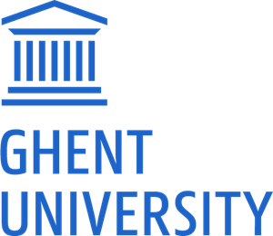

    
    
    
    

Forests are an important part of our ecosystems and produce a large part of the air we breathe. It is important to monitor and survey forests and trees. Using Artificial Intelligence for monitoring and surveying of forests is one way to reduce costs and interpret different kinds of data (color and hyperspectral images). Recent progress in Artificial Intelligence through Neural Networks and Deep Learning means more widespread applications are now at hand and the exploitation of large amounts of data.

Content
Satellite Earth observation has become a key technology in forest monitoring. With the European earth observation program Copernicus, a program exists that provides access to temporally high-resolution and freely available satellite images, and this worldwide. New analysis methods are needed to deal with the huge amounts of data; machine learning offers excellent opportunities here. Even with UAVs, huge amounts of data are often generated when, for example, ground resolutions of 2 cm are used. Concrete evaluation topics are eg. the detection of game damage or the differentation of tree species.

Topics which will be addressed:

Introduction to Python and Tensorflow Keras
Introduction to classical machine learning and deep Learning
Deep Learning architectures and their application fields
Example forestry applications
Deep Learning with Python and Keras
The skills learned in this course also transfer to many other application fields that use image or video data.

Learning outcomes
In this module, students acquire key qualifications for the use of Deep Learning algorithms for forestry applications, which are also transferable to other applications in other disciplines. They learn the principles of Deep learning as well as neural networks and their optimisation. They will develop an understanding of which problems can be solved with the methods of Deep Learning and which methods should be selected. After completing the module, the students are able to freely program Deep Learning applications in Python. They can independently implement existing neural networks and handle implementing existing neural networks and deadl with large amounts of data.

Programme
To be announced after registration. Tentative program includes lectures on AI and Deep Learning, Data Science and Image Processing with Python, Forestry, and sessions on Intercultural Competences.

Around 45 students will work in groups of three, each from one partner University, so approximately 15 groups. Less than 10 students from each of the organising universities (Groningen, Goettingen, Bordeaux) and 3 to 5 students per other ENLIGHT university. The final selection of students will be done by a committee formed by the organising universities. Applying students will receive the confirmation of their acceptance in the first week of December.

Assessment
Assessment will be through a project to be developed during the on-site period and afterwards. There will be a presentation on the last on-site day, and a final report that will be graded and completes the course. A Transcript of Records will be provided a month after the course ends.

_Our team after our presentation. Left to right: Mansur (me), Lucien, Christian and Kasper._

<aside>
⭐ Special thanks to the lecturers and the organizing team for the great course. It was a pleasure to learn from you and work with you.

- Dr. Nils Nölke & Dr. Lutz Fehrmann (University of Göttingen),
- Prof. Jean-Christophe Taveau (University of Bordeaux),
- Prof. Matias Valdenegro Toro (University of Groningen),
- Prof. Andreea Sburlea (University of Groningen)
- and other lecturers from the University of Groningen.
</aside>
