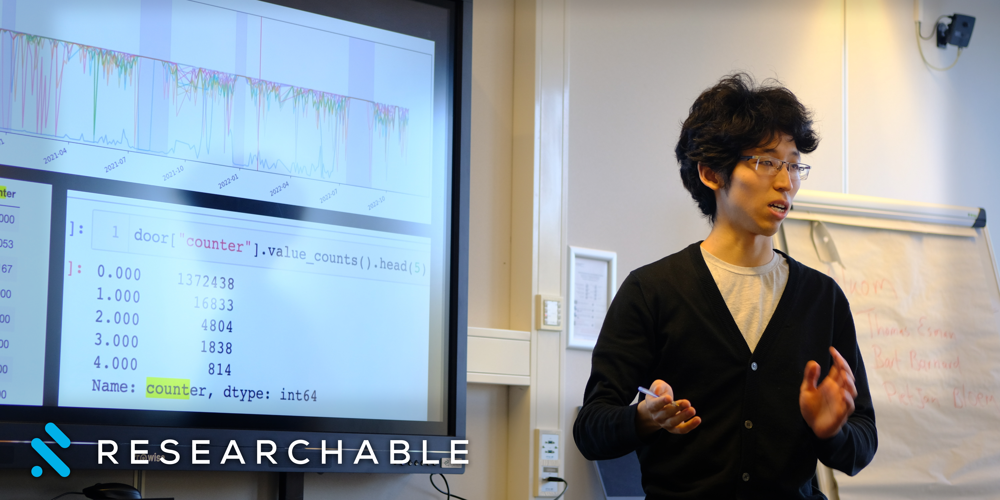
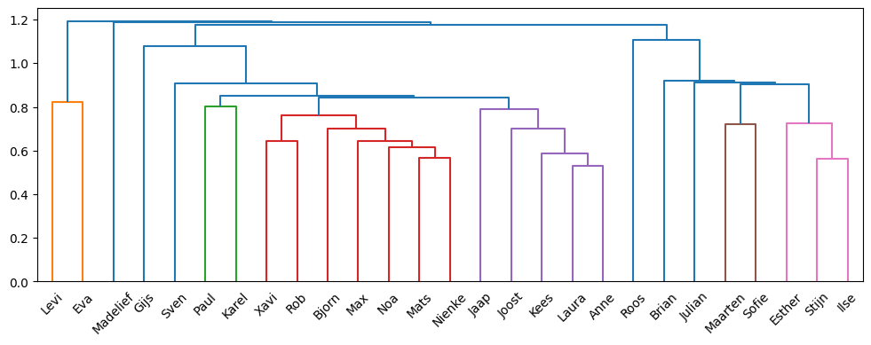
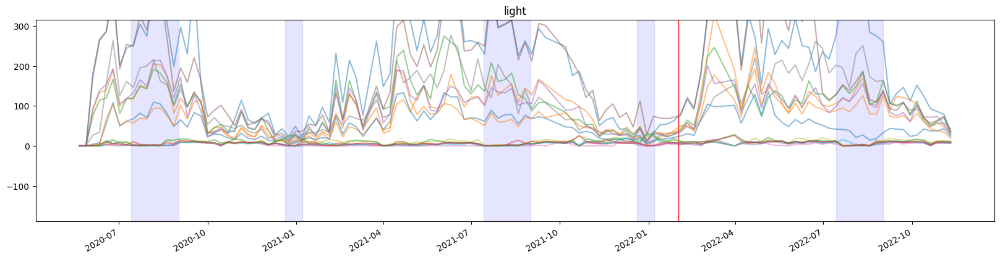

# Hi, Data Challenges Students 👋

If you are reading this, you probably just sat through my guest lecture for **Data Challenges in AI Systems**.

In class, you study the "Happy Path" of MLOps: nice pipelines, labeled datasets, and stable distributions. But when we entered the _Mind Your Building_ challenge, we faced the reality of legacy infrastructure.

**The Business Goal:** The university didn't just want "insights." They wanted a **Predictive Occupancy Model** to optimize HVAC (Heating, Ventilation, and Air Conditioning) schedules.
**The Metric:** Reduce energy waste (heating empty rooms) without freezing students (under-heating busy rooms).
**The Constraint:** No cameras. No turnstiles. Just 18 months of raw, broken sensor data.

Here is how we mapped this messy reality to the four learning outcomes of your course: **Pipelines**, **Optimization**, **Drift**, and **Mitigation**.

## 1. Pipeline Design & Quality: Quantifying the Mess

**Course Concept:** _Design and implement effective data collection pipelines._

The first rule of sensor data is that hardware degrades. We didn't just "look" at the data; we had to diagnose the system health before training anything.

**The Diagnosis:**

- **Validity:** We found temperature readings of -1002°C.
- **Completeness:** About 15% of the timestamps had missing values.
- **Reliability:** The door sensors had a `counter` column that spiked to 5000 and reset randomly.

**The Engineering Decision (Cleaning vs. Leakage):**
A novice might just `.dropna()` or backfill everything. But in a time-series forecasting task, **backfilling is dangerous**. If you fill a 3-hour gap with future data (interpolation) and then split your train/test set randomly, you commit **Data Leakage**. The model learns from the future.

**Our Approach:**

1.  **Sanity Filters:** We dropped physical impossibilities (Temp < 0°C inside).
2.  **Imputation Policy:** We used linear interpolation _only_ for gaps smaller than 20 minutes (transient sensor failure). For gaps larger than 20 minutes (system outage), we flagged the data as `invalid` rather than hallucinating a signal.
3.  **Feature Selection:** We dropped the `door_counter` entirely because the signal-to-noise ratio was too low to trust.

## 2. Integration: Inferring Metadata

**Course Concept:** _Data integration and entity mapping._

We had a physical graph (the floor plan) and a digital graph (the time series), but they were disconnected. Several sensors were labeled `unknown`.

We used **Hierarchical Clustering (Dendrograms)** on the Pearson correlation matrix of the sensor signals.

**Critical Nuance:**
In the lecture, I said we "reverse-engineered the walls." To be strictly accurate, we identified **Common Cause Clusters**.
Sensors in the same cluster might be in the same room, _or_ they might just be in the same HVAC zone (sharing a vent). We validated this by cross-referencing our clusters with the few "known" sensors to ground the topology. This allowed us to treat the `unknown` sensors as valid inputs for the zonal model.

## 3. Label Scarcity: Weak Supervision & Physics

**Course Concept:** _Strategies for insufficient data & data augmentation._

This was the hardest constraint. We needed to predict $y$ (Occupancy), but we had zero ground truth labels. No one counted the students.

**The Naive Approach:**
Divide CO2 levels by a standard rate.

**The Engineering Approach (Mass Balance Model):**
CO2 concentration isn't just about people; it's a differential equation involving **Volume** and **Ventilation Rate** (Air Changes Per Hour).
$$V \frac{dC}{dt} = G - Q(C - C_{out})$$
_Where $G$ is generation (people), $Q$ is ventilation, and $V$ is volume._

Since we didn't know the exact ventilation rate $Q$, we couldn't create a perfect "People Counter." Instead, we created **Weak Labels** (or "Silver Labels").

1.  We simplified the model to steady-state assumptions for "Busy" vs. "Empty" classification.
2.  We validated these weak labels against the _University Timetable_ (a noisy proxy for truth).

**The Result:**
We didn't get a perfect count (e.g., "7 people"), but we achieved a robust **Ordinal Classification** (Empty / Low / High Occupancy). This was sufficient for the business goal (turning on the HVAC), even if the exact count was noisy.

## 4. Drift & Mitigation: The COVID Break

**Course Concept:** _Analyze and address data distribution changes._

Your course covers **Concept Drift**. Our dataset (2020–2022) is the textbook definition of it.

**The Drift:**

- **Covariate Shift:** The input distribution $P(X)$ changed. In 2020, motion sensors were active 9-5. In 2021 (Lockdown), they were flat.
- **Concept Drift:** The relationship $P(y|X)$ changed. In 2022 (Hybrid), a room with low motion might still have people sitting quietly on Zoom calls, whereas in 2019, low motion meant empty.

**The Mitigation Strategy:**
A model trained on 2019 data would fail in 2022.

1.  **Temporal Splitting:** We strictly split training and validation by time (pre-COVID vs. post-COVID) to measure generalization.
2.  **Monitoring:** In a production system, we would monitor **PSI (Population Stability Index)** on the motion sensor distribution. If the PSI spikes (like it did in March 2020), it triggers a retraining pipeline or falls back to a rules-based HVAC schedule.

## 5. Governance & Privacy

**Course Concept:** _Privacy by design._

We built this system without cameras. This is a **Privacy by Design** win, but it doesn't mean we are off the hook.
Even "metadata" (CO2 + Motion) can be used for surveillance (e.g., "Is the professor in their office?").

**Governance Controls:**

- **Aggregation:** The model outputs zonal occupancy, not individual tracking.
- **Retention:** Raw sensor data should be purged after the training window (e.g., 18 months), retaining only the aggregated weights.

## Summary

Real-world data engineering isn't just about `import sklearn`.

- We turned **Bad Data** into a clean signal using specific imputation policies.
- We solved **Label Scarcity** using domain physics (Weak Supervision).
- We accounted for **Drift** by acknowledging the non-stationary nature of a post-COVID world.

Good luck with your exams. Remember: The model is only as good as the pipeline that feeds it. ✌️
